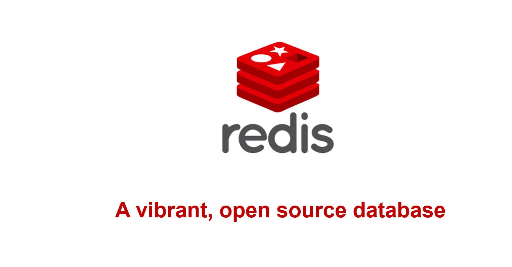 

**A vibrant, open source database**

 

NOSQL

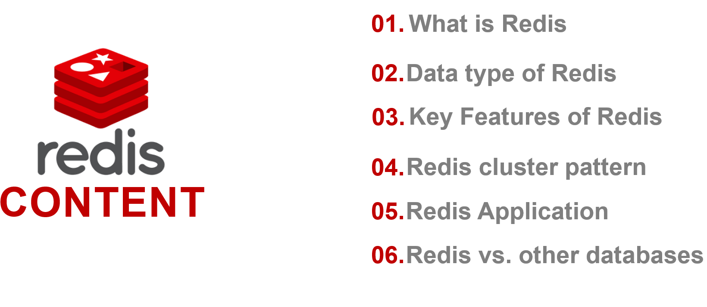a name="br3"></a> 

**01. What is Redis**

**02.Data type of Redis**

**03.Key Features of Redis**

**04.Redis cluster pattern**

**05.Redis Application**

**CONTENT**

**06.Redis vs. other databases**

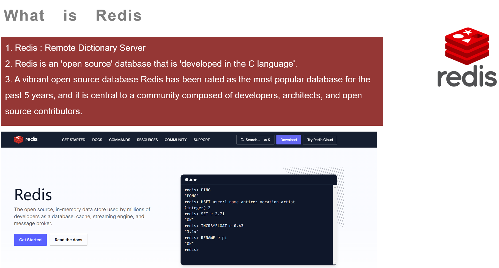 

**What is Redis**

1\. Redis : Remote Dictionary Server

2\. Redis is an 'open source' database that is 'developed in the C language'.

3\. A vibrant open source database Redis has been rated as the most popular database for the

past 5 years, and it is central to a community composed of developers, architects, and open

source contributors.

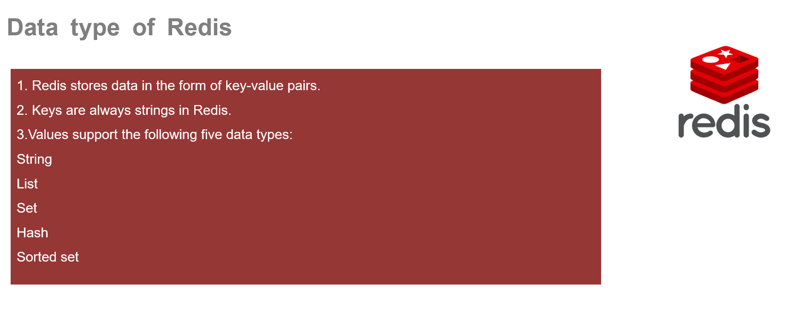 

**Data type of Redis**

1\. Redis stores data in the form of key-value pairs.

2\. Keys are always strings in Redis.

3\.Values support the following five data types:

String

List

Set

Hash

Sorted set

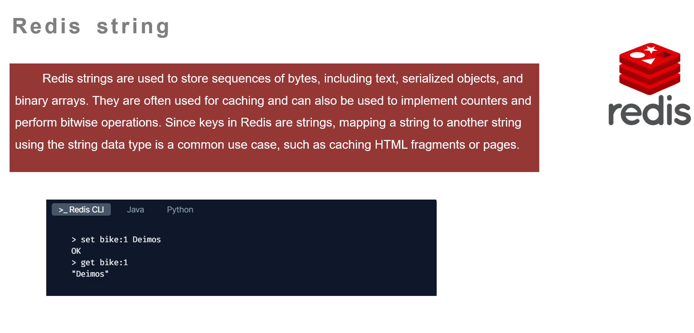 

**Redis string**

Redis strings are used to store sequences of bytes, including text, serialized objects, and

binary arrays. They are often used for caching and can also be used to implement counters and

perform bitwise operations. Since keys in Redis are strings, mapping a string to another string

using the string data type is a common use case, such as caching HTML fragments or pages.

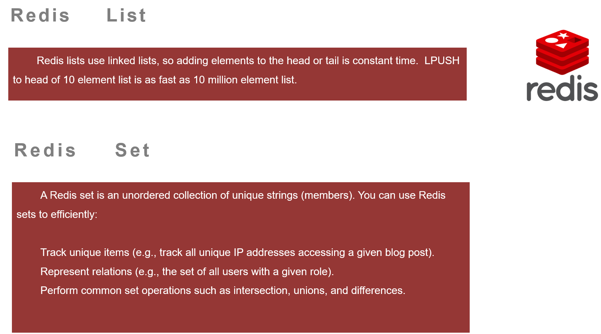 

**Redis List**

Redis lists use linked lists, so adding elements to the head or tail is constant time. LPUSH

to head of 10 element list is as fast as 10 million element list.

**R e d i s S e t**

A Redis set is an unordered collection of unique strings (members). You can use Redis

sets to efficiently:

Track unique items (e.g., track all unique IP addresses accessing a given blog post).

Represent relations (e.g., the set of all users with a given role).

Perform common set operations such as intersection, unions, and differences.

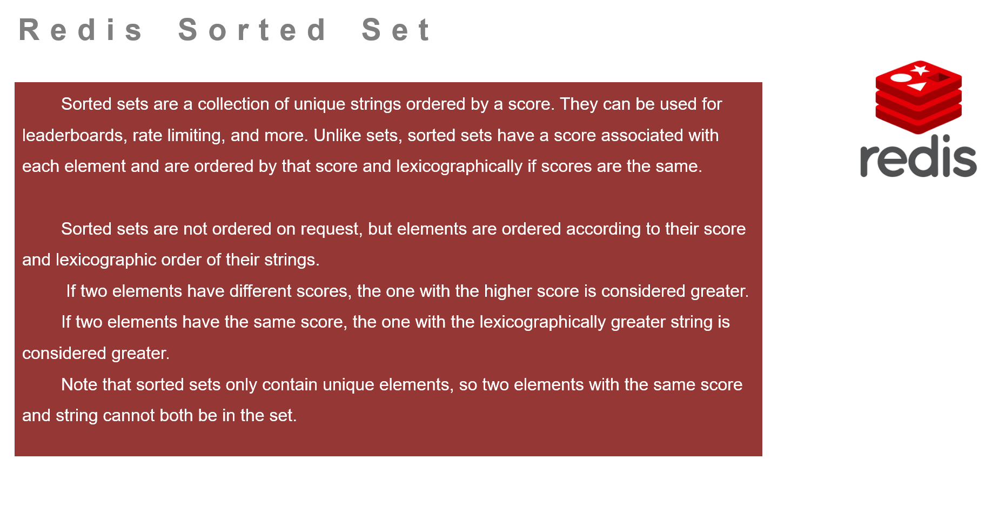 

**R e d i s S o r t e d  S e t**

Sorted sets are a collection of unique strings ordered by a score. They can be used for

leaderboards, rate limiting, and more. Unlike sets, sorted sets have a score associated with

each element and are ordered by that score and lexicographically if scores are the same.

Sorted sets are not ordered on request, but elements are ordered according to their score

and lexicographic order of their strings.

If two elements have different scores, the one with the higher score is considered greater.

If two elements have the same score, the one with the lexicographically greater string is

considered greater.

Note that sorted sets only contain unique elements, so two elements with the same score

and string cannot both be in the set.

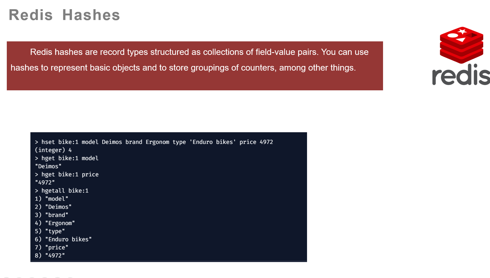 

**Redis Hashes**

Redis hashes are record types structured as collections of field-value pairs. You can use

hashes to represent basic objects and to store groupings of counters, among other things.

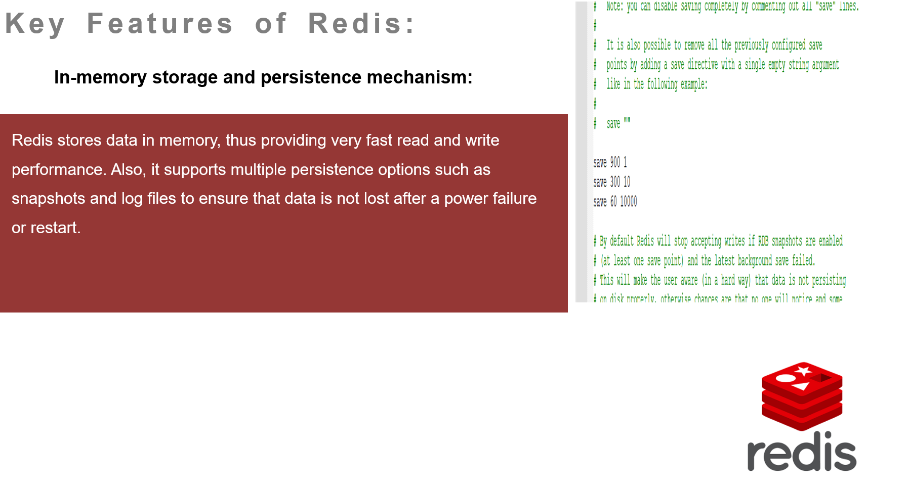a name="br10"></a> 

**K e y F e a t u r e s o f R e d i s :**

**In-memory storage and persistence mechanism:**

Redis stores data in memory, thus providing very fast read and write

performance. Also, it supports multiple persistence options such as

snapshots and log files to ensure that data is not lost after a power failure

or restart.

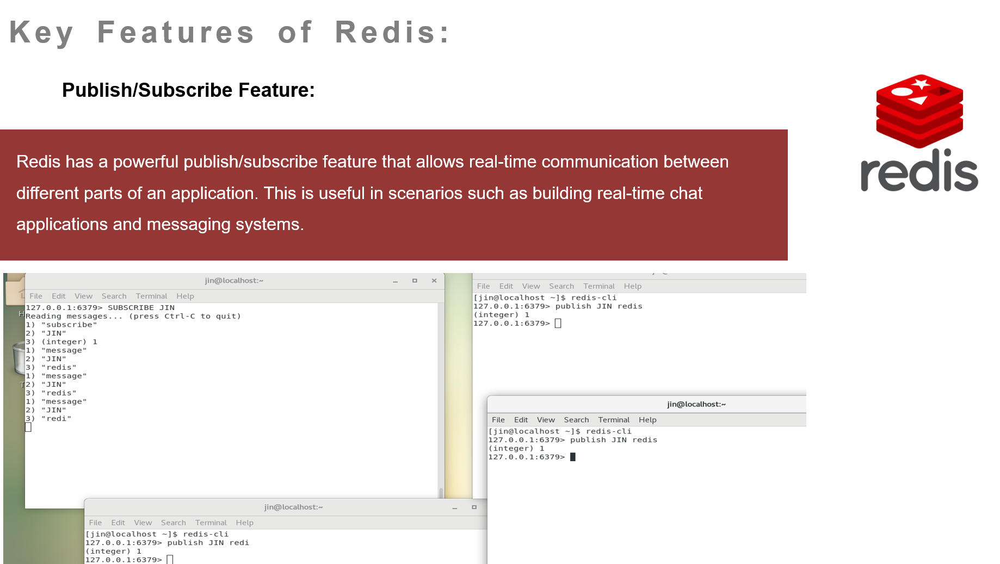 

**K e y F e a t u r e s o f R e d i s :**

**Publish/Subscribe Feature:**

Redis has a powerful publish/subscribe feature that allows real-time communication between

different parts of an application. This is useful in scenarios such as building real-time chat

applications and messaging systems.

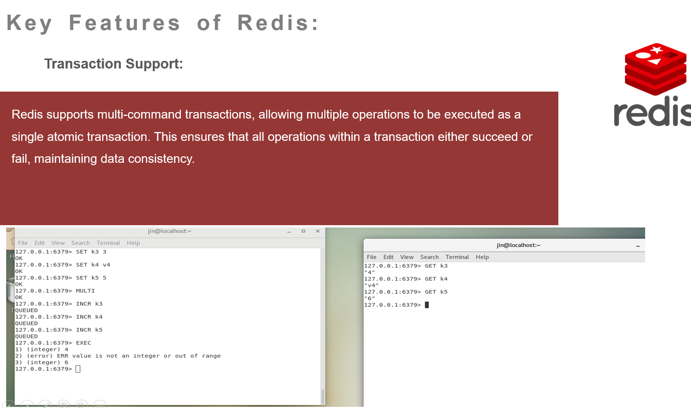 

**K e y F e a t u r e s  o f R e d i s :**

**Transaction Support:**

Redis supports multi-command transactions, allowing multiple operations to be executed as a

single atomic transaction. This ensures that all operations within a transaction either succeed or

fail, maintaining data consistency.

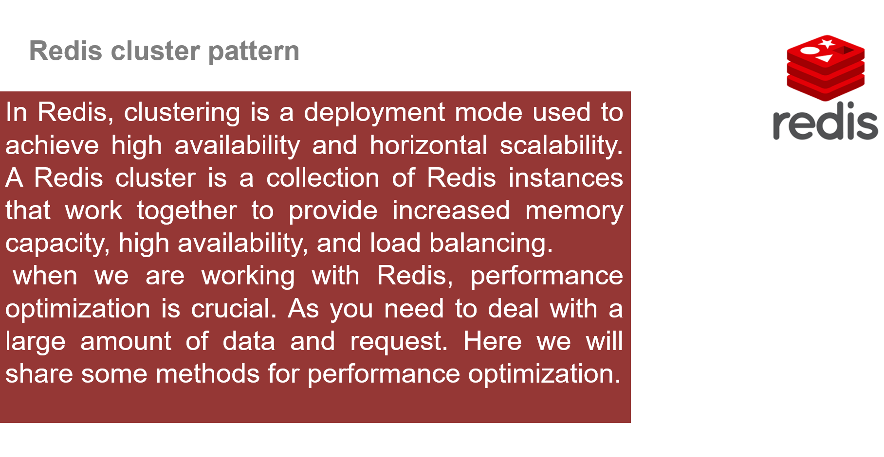 

**Redis cluster pattern**

In Redis, clustering is a deployment mode used to achieve high availability and horizontal scalability.A Redis cluster is a collection of Redis instances that work together to provide increased memory capacity, high availability, and load balancing. when we are working with Redis, performance optimization is crucial. As you need to deal with a large amount of data and request. Here we will share some methods for performance optimization.

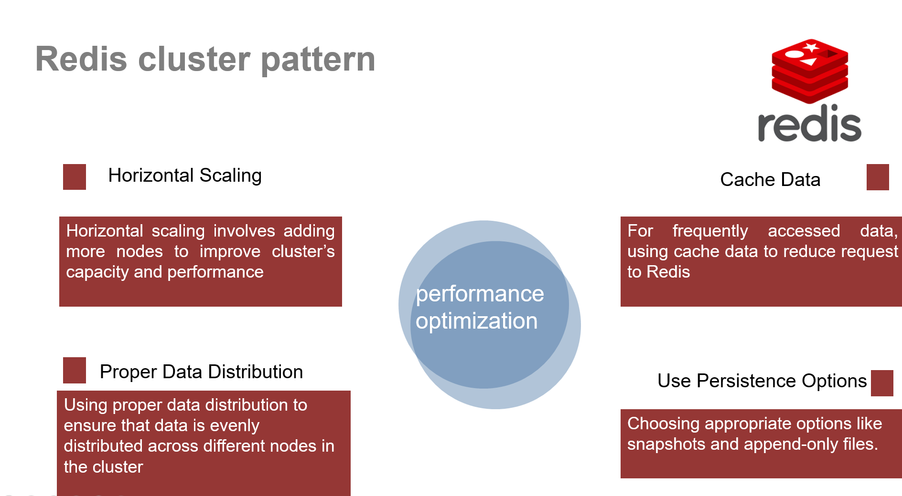

 

**Redis cluster pattern**

Horizontal Scaling

Cache Data

Horizontal scaling involves adding

more nodes to improve cluster’s

capacity and performance

For frequently accessed data,

using cache data to reduce request to Redis

performance

optimization

Proper Data Distribution

Use Persistence Options

Using proper data distribution to

ensure that data is evenly

distributed across different nodes in

the cluster

Choosing appropriate options like

snapshots and append-only files.

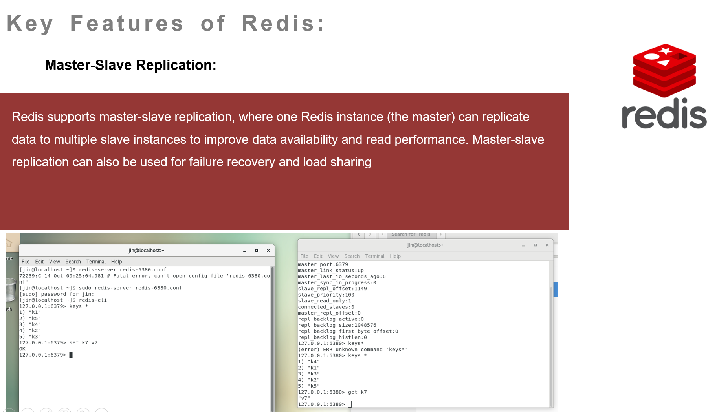 

**K e y F e a t u r e s o f R e d i s :**

**Master-Slave Replication:**

Redis supports master-slave replication, where one Redis instance (the master) can replicate

data to multiple slave instances to improve data availability and read performance. Master-slave

replication can also be used for failure recovery and load sharing

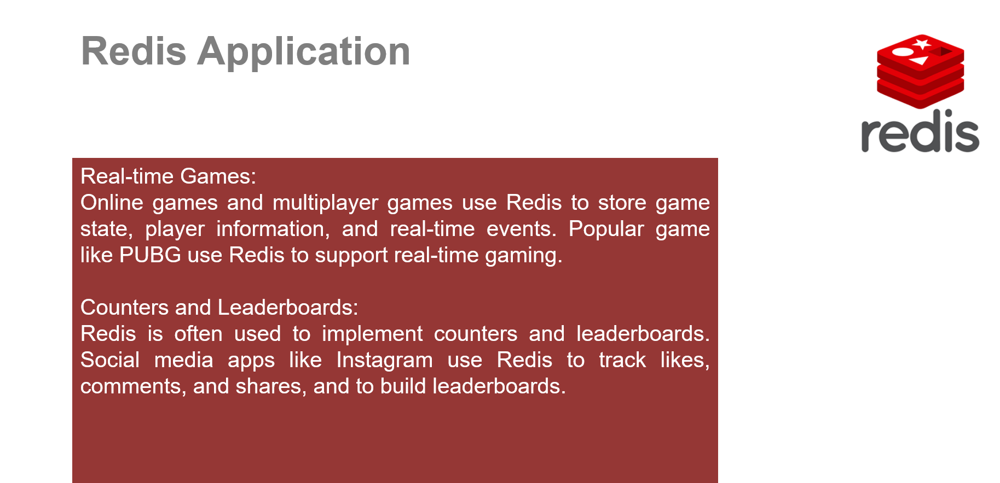 

**Redis Application**

Real-time Games:

Online games and multiplayer games use Redis to store game

state, player information, and real-time events. Popular game

like PUBG use Redis to support real-time gaming.

Counters and Leaderboards:

Redis is often used to implement counters and leaderboards.

Social media apps like Instagram use Redis to track likes,

comments, and shares, and to build leaderboards.

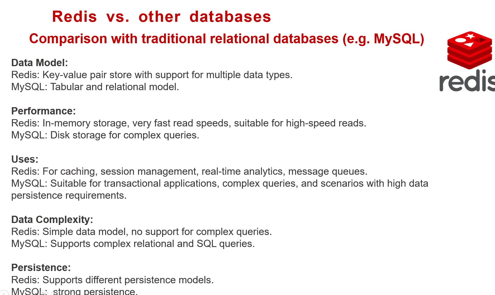 

**Redis vs. other databases**

**Comparison with traditional relational databases (e.g. MySQL)**

**Data Model:**

Redis: Key-value pair store with support for multiple data types.

MySQL: Tabular and relational model.

**Performance:**

Redis: In-memory storage, very fast read speeds, suitable for high-speed reads.

MySQL: Disk storage for complex queries.

**Uses:**

Redis: For caching, session management, real-time analytics, message queues.

MySQL: Suitable for transactional applications, complex queries, and scenarios with high data

persistence requirements.

**Data Complexity:**

Redis: Simple data model, no support for complex queries.

MySQL: Supports complex relational and SQL queries.

**Persistence:**

Redis: Supports different persistence models.

MySQL: strong persistence.

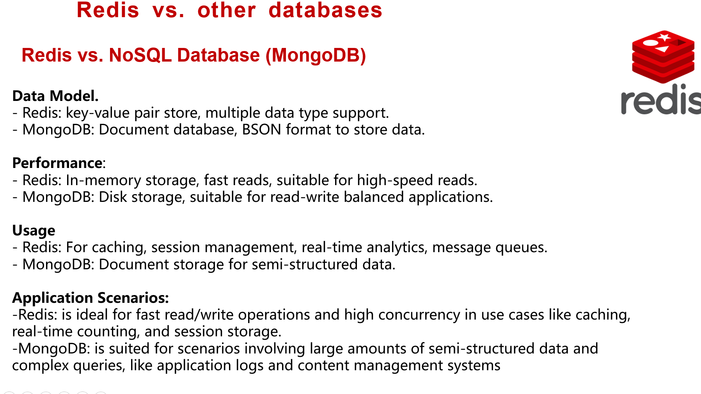 

**Redis vs. other databases**

**Redis vs. NoSQL Database (MongoDB)**

**Data Model.**

\- Redis: key-value pair store, multiple data type support.

\- MongoDB: Document database, BSON format to store data.

**Performance**:

\- Redis: In-memory storage, fast reads, suitable for high-speed reads.

\- MongoDB: Disk storage, suitable for read-write balanced applications.

**Usage**

\- Redis: For caching, session management, real-time analytics, message queues.

\- MongoDB: Document storage for semi-structured data.

**Application Scenarios:**

-Redis: is ideal for fast read/write operations and high concurrency in use cases like caching, real-

time counting, and session storage.

-MongoDB: is suited for scenarios involving large amounts of semi-structured data and complex

queries, like application logs and content management systems

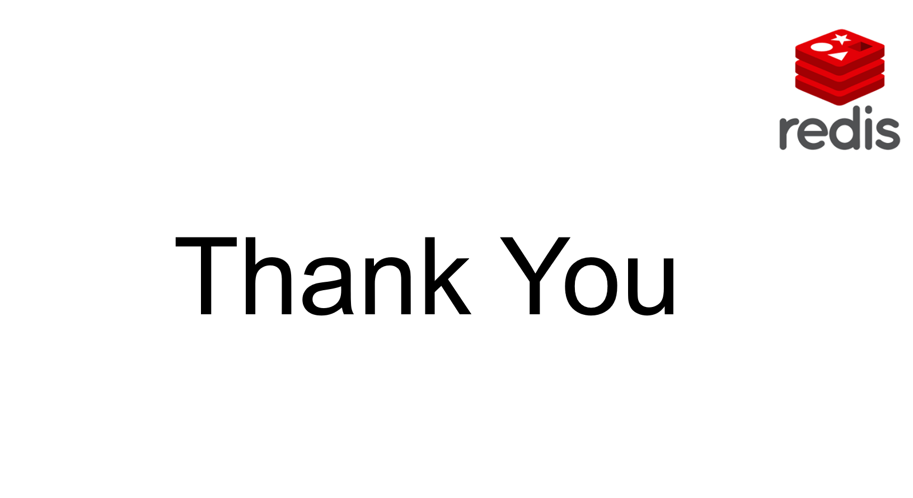 

Thank You

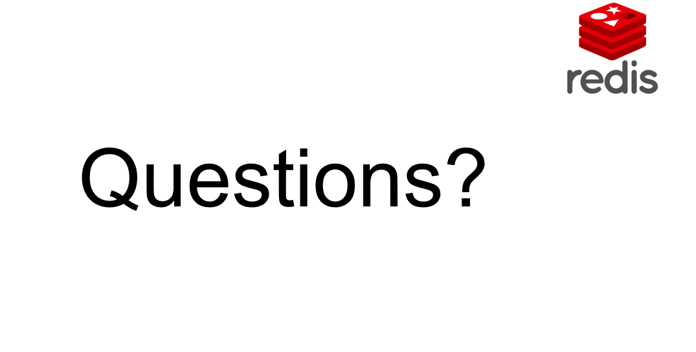 

Questions?

